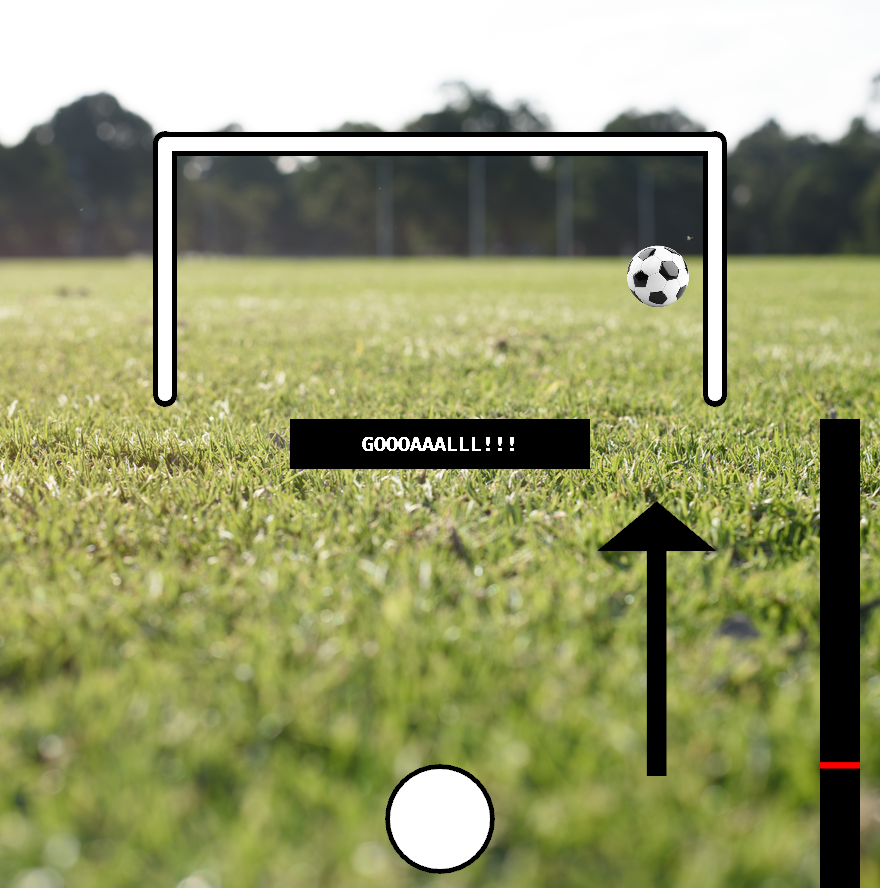
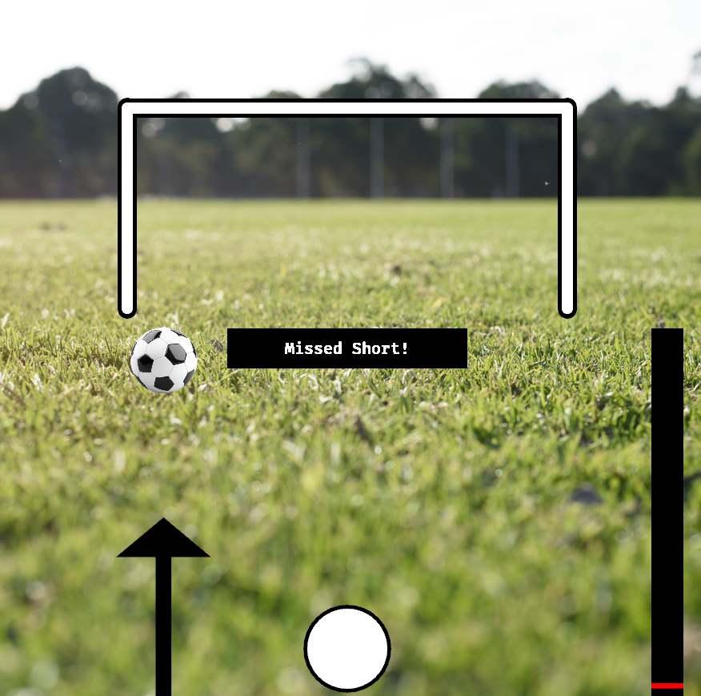
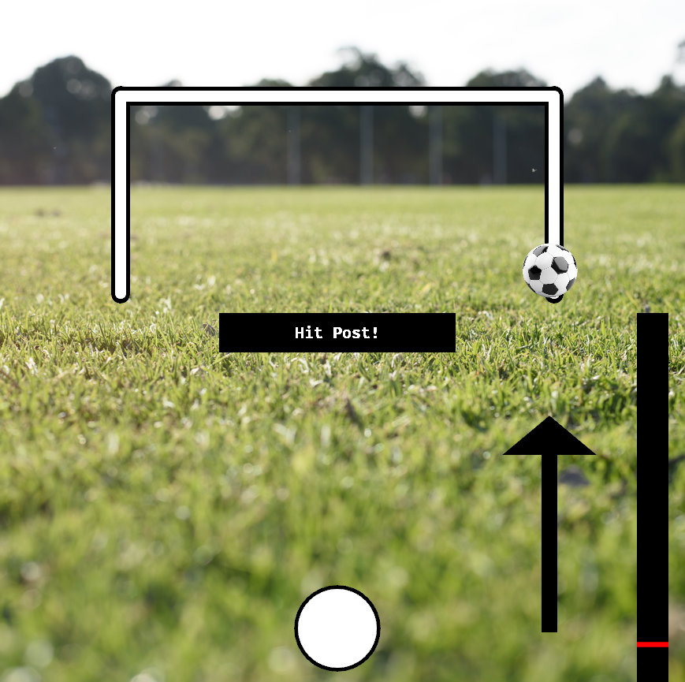
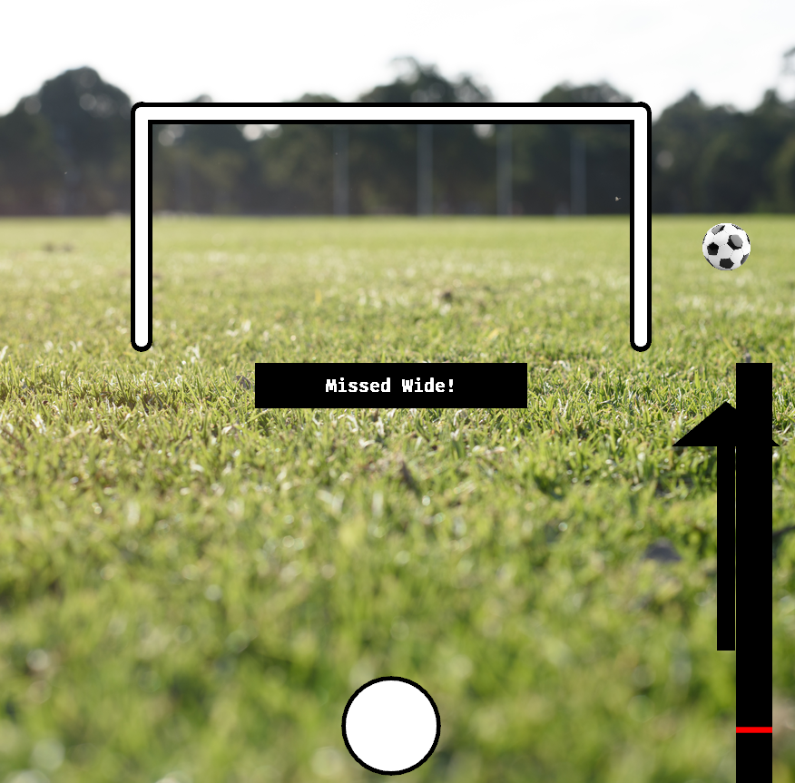
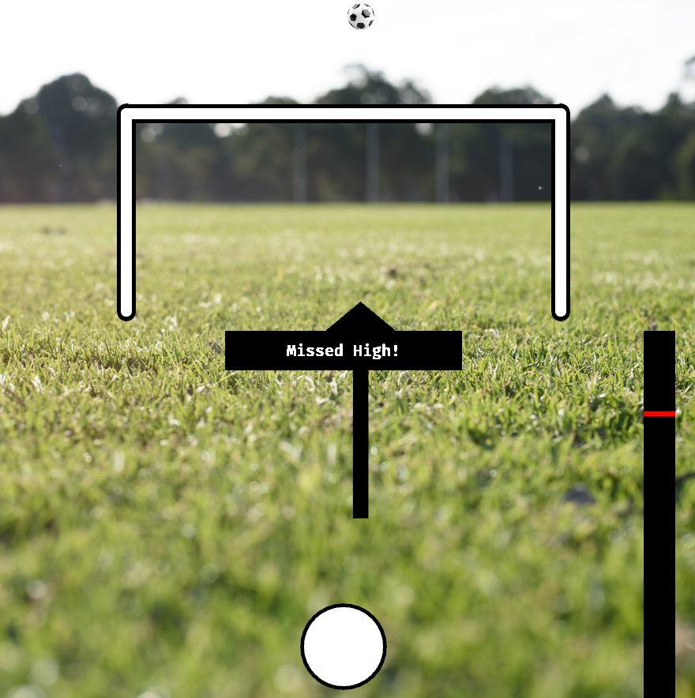

# Soccer Star
## Cristian Ion

Soccer Star is a 2D game written in rust using Bevy. The user gets to take a penalty shot at a soccer goal. The user gets to select the shot's direction and power by pressing buttons on the keyboard. These actions will decide the x-axis, and y-axis destination of the shot. The challenges of this game are to select the right actions from a rapidly moving arrow and power bar. Based on the shot the game will display a message of the outcome. Outcomes are Goal, and misses by Hitting the post, missing wide, missing short, and missing high.

(green-grass-background.png and
ball.png are designed by freepic 
https://www.freepik.com/)

MIT License

Copyright (c) [year] [fullname]

Permission is hereby granted, free of charge, to any person obtaining a copy
of this software and associated documentation files (the "Software"), to deal
in the Software without restriction, including without limitation the rights
to use, copy, modify, merge, publish, distribute, sublicense, and/or sell
copies of the Software, and to permit persons to whom the Software is
furnished to do so, subject to the following conditions:

The above copyright notice and this permission notice shall be included in all
copies or substantial portions of the Software.

THE SOFTWARE IS PROVIDED "AS IS", WITHOUT WARRANTY OF ANY KIND, EXPRESS OR
IMPLIED, INCLUDING BUT NOT LIMITED TO THE WARRANTIES OF MERCHANTABILITY,
FITNESS FOR A PARTICULAR PURPOSE AND NONINFRINGEMENT. IN NO EVENT SHALL THE
AUTHORS OR COPYRIGHT HOLDERS BE LIABLE FOR ANY CLAIM, DAMAGES OR OTHER
LIABILITY, WHETHER IN AN ACTION OF CONTRACT, TORT OR OTHERWISE, ARISING FROM,
OUT OF OR IN CONNECTION WITH THE SOFTWARE OR THE USE OR OTHER DEALINGS IN
THE SOFTWARE.